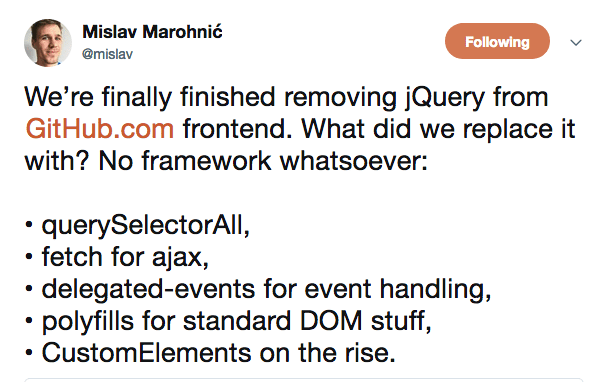
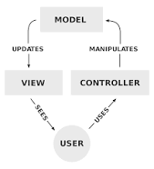

# Agenda

## Motivation 1: Why use frameworks and libraries at all?
At this point, we've done well to teach ourselves some "vanilla" HTML/CSS/JS. With the tools we have, we can build any front-end project. 

However, there are problems with our vanilla approach. For one, we've already seen that HTML, CSS and JS are often a pain to write –– we swapped in JQuery to ease some problems for us! We added Bootstrap to ease the pain off of building something that we use repeatedly! Relying on the foundation of what others have built for our use is good programming practise!

There is an argument to be made that splitting code into HTML, CSS and JS chunks is bad practise. I wouldn't go that far, but when everything is defined globally, it leads to no separation of concerns. Our feedback form shouldn't know about the navigation bar!

Pure HTML, CSS and JS also reduces reusability. How many times do we have to write the same piece of HTML/CSS? Many!!

As your project grows, pure HTML, CSS and JS will get more and more unweildy, harder to document, and difficult to maintain.

This is, of course, the tip of a massive iceberg. 

And I would be remiss if I didn't play the devil's advocate: 


## Motivation 2: Why use the "React" framwork?
React.JS is one of the most popular libraries for front-end web development. It's open-source, and has a huge community of developers working on open source projects through it. Facebook (yes, that Facebook) uses React!

React fits very cleanly into the MVC model of development we previously talked about. Quick reminder about that:


React is incredibly good at scoping and components –– ie, it is object oriented and does separation of concerns well. It's also similar to Bootstrap and Jquery in that it's unrestrictive –– you can use as much or as little of it as you desire!

It also removes the barrier created by different languages being in different files (how? More on that later!), which helps in creating a more modular project.

The biggest power of React, however, is its renderer. While Javascript is messy with how it handles dynamic re-render, React.JS is clean. Something that might take you 20 lines of code in JS takes you one in React.

Cons of React: Sharp learning curve :(, JSX is confusing (I second this one, I still get confused!) and it's a big library, decreasing how light-weight your code can be. (Longer load times)


## Fancy Example!
Fork this repo, then run the commands `npm install` and `npm start` in your terminal of choice. Enjoy a fancy frontend calculator!

## Simplest Possible Example
Replace the lines in `index.js` with the following:
```
let a = "Hi"
let b = <p> This is Hello </p>
ReactDOM.render(
   <h1>{a}{b}</h1>,
    document.getElementById("root"));
```

## Breakdown of How React Works Alongside HTML/CSS/JS
DOM Updation

## What is JSX?
HTML in JS.

## Some Simple Examples of JSX
See above!

## What's Going On Behind the Scenes With JSX?
```
React.createElement(
  type,
  [props],
  [...children]
)
```