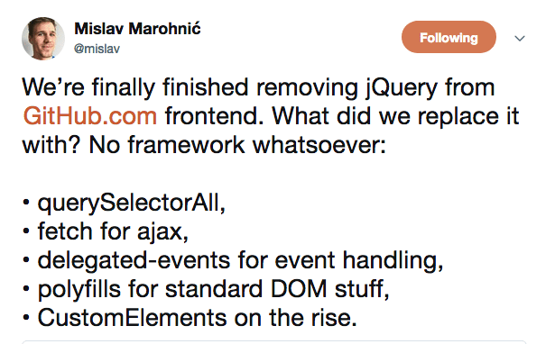

# Agenda

## Motivation 1: Why use frameworks and libraries at all?
At this point, we've done well to teach ourselves some "vanilla" HTML/CSS/JS. With the tools we have, we can build any front-end project. 

However, there are problems with our vanilla approach. For one, we've already seen that HTML, CSS and JS are often a pain to write –– we swapped in JQuery to ease some problems for us! We added Bootstrap to ease the pain off of building something that we use repeatedly! Relying on the foundation of what others have built for our use is good programming practise!

There is an argument to be made that splitting code into HTML, CSS and JS chunks is bad practise. I wouldn't go that far, but when everything is defined globally, it leads to no separation of concerns. Our feedback form shouldn't know about the navigation bar!

Pure HTML, CSS and JS also reduces reusability. How many times do we have to write the same piece of HTML/CSS? Many!!

As your project grows, pure HTML, CSS and JS will get more and more unweildy, harder to document, and difficult to maintain.

This is, of course, the tip of a massive iceberg. 

And I would be remiss if I didn't play the devil's advocate: 

## Motivation 2: Why use the "React" framwork?

## Fancy Example!
Fork this repo, then run the commands `npm install` and `npm start` in your terminal of choice. Enjoy a fancy frontend calculator!

Simplest Possible Example

Breakdown of How React Works Alongside HTML/CSS/JS

What is JSX?

Some Simple Examples of JSX

What's Going On Behind the Scenes With JSX?